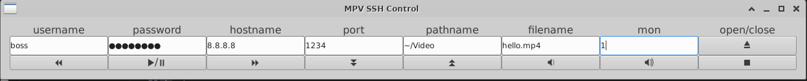

# GTK GUI to control media player MPV by SSH

This small graphical tool could help you to control media player MPV remotely by SSH from handy clients side devices like PC, mini-PC (raspberry), laptop, phone (android + termux) with GTK and ssh-client support.

Its suits for following scenarios:

1. You want watch video with big TV, monitor, projector connected to servers devices like: PC, laptop, linux or android TV box with ssh-server and mpv installed
2. You want control SmartTV that has mpv and ssh-server installed

## Dependencies for client side application

- sshpass - helper for ssh password
- screen - ssh session manager
- gcc - C compiler
- gtk3 libraries
- make - build tool

To install dependencies on Debian-based systems use following commands:
```
apt install sshpass screen  build-essential libgtk-3-dev make
```

To install dependencies on rpm-based systems use following commands:

```
yum install sshpass screen gcc gtk3-devel make
```

## Compile and run

Clone code from github repo and run `make`

```
git clone https://github.com/allseenn/mpv.git
cd mpv
make
make install
```

Default installation path is `/usr/local/sbin`

After seccessful installation run `mpvg`:

```
mpvg
```

## User interface



Program has table like interface with 3 rows:

- labels
- entry fields
- buttons

Labels are connected my meaning to field bellow, buttons not allowed to be connected with meaning.
So we have 16 key elements: 7 fields and 9 buttons.

7 fields:

1. username
2. password
3. hostname
4. port
5. path
6. file
7. mon(itor)

9 buttons and their actions:

1. ⏪ - rewind backward
2. ▶️/⏸️ - pause/play
3. ⏩ - skeep forward
4. ⏬ - speed down
5. ⏫ - speed up
6. 🔉 - volume down
7. 🔊 - volume down
9. ⏏️ - open file or url
10. ⏹️ - stop file or url

### UserName

Fill `username` field with login-name of you server where mpv and ssh-service installed.

### Password

Fill `password` field with password of you server where mpv and ssh-service installed, if you use ssh-agent you could leave it empty.

### HostName

Fill `hostname` field with hostname or ip-address of you server where mpv and ssh-service installed.

### Port

Fill `port` field with port of you server where mpv and ssh-service installed. Default value is `22`.

### Path

Fill `path` field with absolute path to directory where media files located. Default value is `~` home directory.

### File

Fill `file` field with  media file name with extension like: video.mp4

### Mon

If your server has several monitors you could set it here. Default value is `0` - first monitor, 1 - second monitor etc.

### Open file or url

After you fill all nescessary fields click `Open file or url` button 9. ⏏️ - it will start MPV in fullscreen mode with selected file and monitor.

### Stop and close MPV

Click `Stop file or url` button 10. ⏹️ - it will stop MPV, close ssh session and delete socket file.

### Play / Pause

Button 2. ▶️/⏸️ - pause or play selected earlier file

### Rewinds

You could user button 1. ⏪ and  3. ⏩ to slowly rewind backward and forward you media file.

### Speed

Buttons 4. ⏬  and 5. ⏫ slow down or speed up playing media file.

### Volume

Buttons 6. 🔉 and 7. 🔊 controls volume of you playback to down or up.